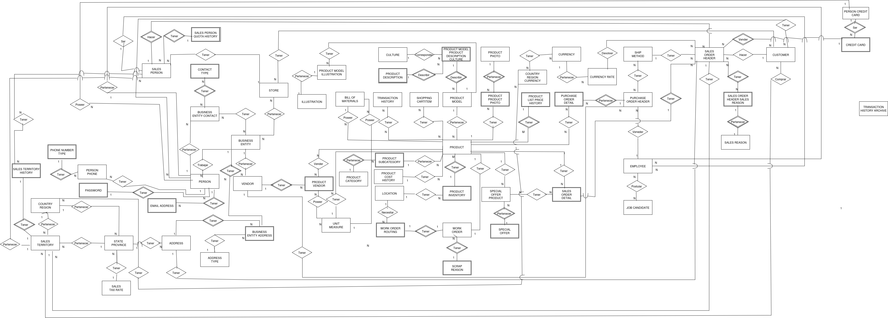
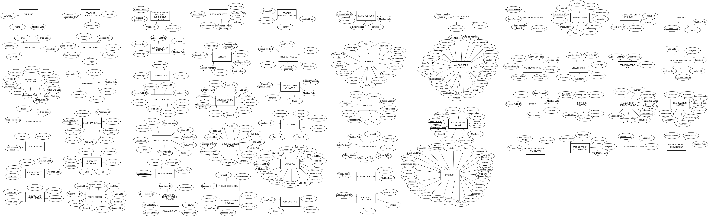
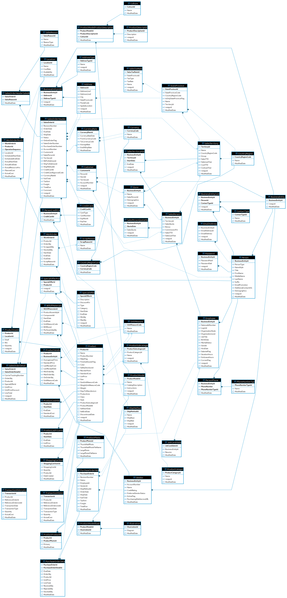

# AdventureWorks Core

## Resumen

Esta fuente de datos proviene de las ventas realizadas en la empresa, registrando toda la información de esta ,así como el empleado, entidad de negocio, personal, y datos del cliente que esten implicados en ella. Su propósito es recopilar y almacenar todo lo relacionado con las ventas para análisis futuros .

## Modelo conceptual

## Modelo lógico

## Catálogo de datos

#### 🔹 Tabla: Address 

**Propósito:**  

Almacena la información de las direcciones físicas de entidades comerciales, clientes o proveedores, incluyendo ciudad, código postal y provincia. Cada registro representa una ubicación postal única.

| Campo             | Tipo de Dato | Restricciones                                   | Descripción de Negocio                                                             |
| ----------------- | ------------ | ----------------------------------------------- | ----------------------------------------------------------- |
| `AddressId`       | int          | PK, NOT NULL, AUTO_INCREMENT                    | Identificador único de la dirección.                        |
| `AddressLine1`    | varchar(60)  | NOT NULL                                        | Línea principal de la dirección (calle, número, etc.).      |
| `AddressLine2`    | varchar(60)  | NULL                                            | Información adicional de dirección (edificio, suite, etc.). |
| `City`            | varchar(30)  | NULL                                            | Ciudad donde se ubica la dirección.                         |
| `StateProvinceId` | int          | NOT NULL, FK → `StateProvince(StateProvinceId)` | Identificador del estado o provincia asociada.              |
| `PostalCode`      | varchar(15)  | NOT NULL                                        | Código postal o ZIP code.                                   |
| `SpatialLocation` | varchar(200) | NULL                                            | Coordenadas o ubicación geoespacial.                        |
| `rowguid`         | char(36)     | NOT NULL, DEFAULT uuid()                        | Identificador global único para sincronización.             |
| `ModifiedDate`    | datetime     | NOT NULL, DEFAULT CURRENT_TIMESTAMP             | Fecha de la última modificación del registro.               |

#### 🔹 Tabla: AddressType

**Propósito:**  
Define los tipos de direcciones posibles dentro de la organización (por ejemplo: facturación, envío, contacto principal).

| Campo         | Tipo de Dato | Restricciones                       | Descripción de Negocio                     |
| ------------- | ------------ | ----------------------------------- | ------------------------------------------ |
| AddressTypeId | int          | PK, NOT NULL, AUTO_INCREMENT        | Identificador único del tipo de dirección. |
| Name          | varchar(50)  | NOT NULL                            | Nombre o categoría del tipo de dirección.  |
| rowguid       | char(36)     | NOT NULL, DEFAULT uuid()            | Identificador global único.                |
| ModifiedDate  | datetime     | NOT NULL, DEFAULT CURRENT_TIMESTAMP | Fecha y hora de última modificación.       |

#### 🔹 Tabla: BillOfMaterials

**Propósito:**  
Define la estructura jerárquica de componentes que conforman un producto ensamblado, especificando cantidades y fechas de validez.

| Campo             | Tipo de Dato | Restricciones                               | Descripción de Negocio                                              |
| ----------------- | ------------ | ------------------------------------------- | ------------------------------------------------------------------- |
| BillOfMaterialsId | int          | PK, NOT NULL, AUTO_INCREMENT                | Identificador único de la lista de materiales.                      |
| ProductAssemblyId | int          | FK → Product(ProductId), NULL               | Producto ensamblado principal (puede ser nulo si el nivel es raíz). |
| ComponentId       | int          | FK → Product(ProductId), NOT NULL           | Componente o subproducto utilizado.                                 |
| StartDate         | datetime     | NOT NULL, DEFAULT CURRENT_TIMESTAMP         | Fecha de inicio de validez del componente.                          |
| EndDate           | datetime     | NULL                                        | Fecha final de validez (si aplica).                                 |
| UnitMeasureCode   | char(3)      | FK → UnitMeasure(UnitMeasureCode), NOT NULL | Unidad de medida para la cantidad del componente.                   |
| BOMLevel          | smallint     | NOT NULL                                    | Nivel jerárquico dentro del ensamble.                               |
| PerAssemblyQty    | decimal(8,2) | NOT NULL, DEFAULT 1.00                      | Cantidad del componente usada por unidad del producto ensamblado.   |
| ModifiedDate      | datetime     | NOT NULL, DEFAULT CURRENT_TIMESTAMP         | Fecha y hora de última modificación.                                |

#### 🔹 Tabla: BusinessEntity

**Propósito:**  
Tabla maestra que representa cualquier tipo de entidad comercial (persona, empresa, organización), utilizada como base para relaciones con direcciones, contactos, etc.

| Campo            | Tipo de Dato | Restricciones                       | Descripción de Negocio                        |
| ---------------- | ------------ | ----------------------------------- | --------------------------------------------- |
| BusinessEntityId | int          | PK, NOT NULL, AUTO_INCREMENT        | Identificador único de la entidad de negocio. |
| rowguid          | char(36)     | NOT NULL, DEFAULT uuid()            | Identificador global único.                   |
| ModifiedDate     | datetime     | NOT NULL, DEFAULT CURRENT_TIMESTAMP | Fecha y hora de última modificación.          |

#### 🔹 Tabla: BusinessEntityAddress

**Propósito:**  
Asocia entidades de negocio con direcciones específicas, indicando además el tipo de dirección (por ejemplo, facturación, envío).

| Campo            | Tipo de Dato | Restricciones                                       | Descripción de Negocio                        |
| ---------------- | ------------ | --------------------------------------------------- | --------------------------------------------- |
| BusinessEntityId | int          | PK, FK → BusinessEntity(BusinessEntityId), NOT NULL | Identificador de la entidad de negocio.       |
| AddressId        | int          | PK, FK → Address(AddressId), NOT NULL               | Identificador de la dirección asociada.       |
| AddressTypeId    | int          | PK, FK → AddressType(AddressTypeId), NOT NULL       | Tipo de dirección (envío, facturación, etc.). |
| rowguid          | char(36)     | NOT NULL, DEFAULT uuid()                            | Identificador global único.                   |
| ModifiedDate     | datetime     | NOT NULL, DEFAULT CURRENT_TIMESTAMP                 | Fecha de última modificación.                 |

#### 🔹 Tabla: BusinessEntityContact

**Propósito:**  
Define las relaciones entre entidades comerciales y personas de contacto, clasificadas por tipo de contacto (ejemplo: comprador, gerente, representante de ventas).

| Campo            | Tipo de Dato | Restricciones                                                   | Descripción de Negocio                  |
| ---------------- | ------------ | --------------------------------------------------------------- | --------------------------------------- |
| BusinessEntityId | int          | PK, FK → BusinessEntity(BusinessEntityId), NOT NULL             | Identificador de la entidad de negocio. |
| PersonId         | int          | PK, FK → Person(BusinessEntityId), NOT NULL                     | Identificador de la persona asociada.   |
| ContactTypeId    | int          | PK, FK → ContactType(ContactTypeId), NOT NULL                   | Tipo de contacto (rol o función).       |
| rowguid          | char(36)     | NOT NULL, DEFAULT uuid()                                        | Identificador global único.             |
| ModifiedDate     | datetime     | NOT NULL, DEFAULT CURRENT_TIMESTAMP ON UPDATE CURRENT_TIMESTAMP | Fecha y hora de última modificación.    |

#### 🔹 Tabla: ContactType

**Propósito:**  
Define los roles o categorías de contacto utilizados para clasificar las relaciones entre entidades y personas.

| Campo         | Tipo de Dato | Restricciones                       | Descripción de Negocio                                         |
| ------------- | ------------ | ----------------------------------- | -------------------------------------------------------------- |
| ContactTypeId | int          | PK, NOT NULL, AUTO_INCREMENT        | Identificador único del tipo de contacto.                      |
| Name          | varchar(50)  | NOT NULL                            | Nombre del tipo de contacto (ej. Comprador, Ventas, Finanzas). |
| ModifiedDate  | datetime     | NOT NULL, DEFAULT CURRENT_TIMESTAMP | Fecha de última modificación.                                  |

#### 🔹 Tabla: CountryRegion

**Propósito:**  
Contiene los países o regiones reconocidos en el sistema, usados para direcciones, monedas y relaciones comerciales.

| Campo             | Tipo de Dato | Restricciones                       | Descripción de Negocio                   |
| ----------------- | ------------ | ----------------------------------- | ---------------------------------------- |
| CountryRegionCode | varchar(3)   | PK, NOT NULL                        | Código de país o región (ISO o interno). |
| Name              | varchar(50)  | NOT NULL                            | Nombre del país o región.                |
| ModifiedDate      | datetime     | NOT NULL, DEFAULT CURRENT_TIMESTAMP | Fecha y hora de última modificación.     |

#### 🔹 Tabla: CountryRegionCurrency

**Propósito:**  
Asocia países o regiones con las monedas utilizadas, pudiendo existir relaciones de uno a varios (un país puede manejar múltiples monedas).

| Campo             | Tipo de Dato | Restricciones                                       | Descripción de Negocio               |
| ----------------- | ------------ | --------------------------------------------------- | ------------------------------------ |
| CountryRegionCode | varchar(3)   | PK, FK → CountryRegion(CountryRegionCode), NOT NULL | Código del país o región.            |
| CurrencyCode      | char(3)      | PK, FK → Currency(CurrencyCode), NOT NULL           | Código de la moneda asociada.        |
| ModifiedDate      | datetime     | NOT NULL, DEFAULT CURRENT_TIMESTAMP                 | Fecha y hora de última modificación. |

#### 🔹 Tabla: CreditCard

**Propósito:**  
Contiene la información de tarjetas de crédito utilizadas por los clientes para realizar pagos o transacciones.

| Campo        | Tipo de Dato | Restricciones                       | Descripción de Negocio                          |
| ------------ | ------------ | ----------------------------------- | ----------------------------------------------- |
| CreditCardId | int          | PK, NOT NULL, AUTO_INCREMENT        | Identificador único de la tarjeta de crédito.   |
| CardType     | varchar(50)  | NOT NULL                            | Tipo de tarjeta (Visa, MasterCard, Amex, etc.). |
| CardNumber   | varchar(25)  | NOT NULL                            | Número de la tarjeta de crédito.                |
| ExpMonth     | tinyint      | NOT NULL                            | Mes de expiración.                              |
| ExpYear      | smallint     | NOT NULL                            | Año de expiración.                              |
| ModifiedDate | datetime     | NOT NULL, DEFAULT CURRENT_TIMESTAMP | Fecha y hora de última modificación.            |

#### 🔹 Tabla: Culture

**Propósito:**  
Define los códigos culturales o de idioma utilizados para localizar nombres, descripciones y otros datos multilingües dentro del sistema.

| Campo        | Tipo de Dato | Restricciones                       | Descripción de Negocio                                                    |
| ------------ | ------------ | ----------------------------------- | ------------------------------------------------------------------------- |
| CultureId    | char(6)      | PK, NOT NULL                        | Identificador único del idioma o cultura (por ejemplo, `en-US`, `es-MX`). |
| Name         | varchar(50)  | NOT NULL                            | Nombre descriptivo de la cultura o idioma.                                |
| ModifiedDate | datetime     | NOT NULL, DEFAULT CURRENT_TIMESTAMP | Fecha y hora de última modificación del registro.                         |

#### 🔹 Tabla: Currency

**Propósito:**  
Contiene las monedas utilizadas en las transacciones comerciales, especificando su código y nombre.

| Campo        | Tipo de Dato | Restricciones                       | Descripción de Negocio                                |
| ------------ | ------------ | ----------------------------------- | ----------------------------------------------------- |
| CurrencyCode | char(3)      | PK, NOT NULL                        | Código ISO de la moneda (por ejemplo, USD, EUR, MXN). |
| Name         | varchar(50)  | NOT NULL                            | Nombre descriptivo de la moneda.                      |
| ModifiedDate | datetime     | NOT NULL, DEFAULT CURRENT_TIMESTAMP | Fecha y hora de última modificación del registro.     |

#### 🔹 Tabla: CurrencyRate

**Propósito:**  
Registra las tasas de cambio entre pares de monedas en una fecha determinada. Es fundamental para la conversión de valores internacionales.

| Campo            | Tipo de Dato  | Restricciones                         | Descripción de Negocio                            |
| ---------------- | ------------- | ------------------------------------- | ------------------------------------------------- |
| CurrencyRateId   | int           | PK, NOT NULL, AUTO_INCREMENT          | Identificador único de la tasa de cambio.         |
| CurrencyRateDate | datetime      | NOT NULL                              | Fecha de vigencia de la tasa de cambio.           |
| FromCurrencyCode | char(3)       | FK → Currency(CurrencyCode), NOT NULL | Moneda origen (de la que se convierte).           |
| ToCurrencyCode   | char(3)       | FK → Currency(CurrencyCode), NOT NULL | Moneda destino (a la que se convierte).           |
| AverageRate      | decimal(19,4) | NOT NULL, DEFAULT 0.0000              | Tasa promedio del día para conversiones.          |
| EndOfDayRate     | decimal(19,4) | NOT NULL, DEFAULT 0.0000              | Tasa de cambio al cierre del día.                 |
| ModifiedDate     | datetime      | NOT NULL, DEFAULT CURRENT_TIMESTAMP   | Fecha y hora de última modificación del registro. |

#### 🔹 Tabla: Customer

**Propósito:**  
Representa a los clientes de la organización, ya sean personas individuales o empresas. Incluye relaciones con territorio, persona y tienda.

| Campo         | Tipo de Dato | Restricciones                          | Descripción de Negocio                               |
| ------------- | ------------ | -------------------------------------- | ---------------------------------------------------- |
| CustomerId    | int          | PK, NOT NULL, AUTO_INCREMENT           | Identificador único del cliente.                     |
| PersonId      | int          | FK → Person(BusinessEntityId), NULL    | Referencia a la persona si el cliente es individual. |
| StoreId       | int          | FK → Store(BusinessEntityId), NULL     | Referencia a la tienda o empresa si aplica.          |
| TerritoryId   | int          | FK → SalesTerritory(TerritoryId), NULL | Territorio de ventas asociado al cliente.            |
| AccountNumber | varchar(20)  | NOT NULL                               | Número de cuenta único asignado al cliente.          |
| rowguid       | char(36)     | NOT NULL, DEFAULT uuid()               | Identificador global único del cliente.              |
| ModifiedDate  | datetime     | NOT NULL, DEFAULT CURRENT_TIMESTAMP    | Fecha y hora de última modificación del registro.    |

#### 🔹 Tabla: EmailAddress

**Propósito:**  
Almacena las direcciones de correo electrónico asociadas a las personas registradas en la base de datos.

| Campo            | Tipo de Dato | Restricciones                           | Descripción de Negocio                                            |
| ---------------- | ------------ | --------------------------------------- | ----------------------------------------------------------------- |
| BusinessEntityId | int          | FK → Person(BusinessEntityId), NOT NULL | Identificador de la persona propietaria del correo.               |
| EmailAddressId   | int          | NOT NULL                                | Identificador interno del correo electrónico (único por persona). |
| EmailAddress     | varchar(50)  | NULL                                    | Dirección de correo electrónico.                                  |
| rowguid          | char(36)     | NOT NULL, DEFAULT uuid()                | Identificador global único del registro.                          |
| ModifiedDate     | datetime     | NOT NULL, DEFAULT CURRENT_TIMESTAMP     | Fecha y hora de última modificación.                              |

#### 🔹 Tabla: Employee

**Propósito:**  
Contiene los datos personales, laborales y de estructura organizacional de los empleados de la empresa.

| Campo             | Tipo de Dato | Restricciones                               | Descripción de Negocio                                            |
| ----------------- | ------------ | ------------------------------------------- | ----------------------------------------------------------------- |
| BusinessEntityId  | int          | PK, FK → Person(BusinessEntityId), NOT NULL | Identificador de la persona que es empleado.                      |
| NationalIdNumber  | varchar(15)  | UNIQUE, NOT NULL                            | Número de identificación nacional o del seguro social.            |
| LoginId           | varchar(256) | UNIQUE, NOT NULL                            | Identificador de inicio de sesión del empleado.                   |
| OrganizationNode  | varchar(255) | NULL                                        | Representación jerárquica dentro de la estructura organizacional. |
| OrganizationLevel | int          | NULL                                        | Nivel jerárquico del empleado en la organización.                 |
| JobTitle          | varchar(50)  | NOT NULL                                    | Cargo o título laboral.                                           |
| BirthDate         | date         | NOT NULL                                    | Fecha de nacimiento del empleado.                                 |
| MaritalStatus     | char(1)      | NOT NULL, CHECK (‘M’ o ‘S’)                 | Estado civil (M = casado, S = soltero).                           |
| Gender            | char(1)      | NOT NULL, CHECK (‘M’ o ‘F’)                 | Género del empleado.                                              |
| HireDate          | date         | NOT NULL                                    | Fecha de contratación.                                            |
| SalariedFlag      | tinyint(1)   | NOT NULL, DEFAULT 1                         | Indica si el empleado es asalariado (1 = sí, 0 = no).             |
| VacationHours     | smallint     | NOT NULL, DEFAULT 0, CHECK (0–240)          | Horas de vacaciones disponibles.                                  |
| SickLeaveHours    | smallint     | NOT NULL, DEFAULT 0, CHECK (0–120)          | Horas de licencia por enfermedad.                                 |
| CurrentFlag       | tinyint(1)   | NOT NULL, DEFAULT 1                         | Indica si el empleado sigue activo.                               |
| rowguid           | char(36)     | NOT NULL, DEFAULT uuid()                    | Identificador global único.                                       |
| ModifiedDate      | datetime     | NOT NULL, DEFAULT CURRENT_TIMESTAMP         | Fecha de última modificación.                                     |

#### 🔹 Tabla: Illustration

**Propósito:**  
Almacena diagramas o ilustraciones asociadas a productos o documentos técnicos.

| Campo          | Tipo de Dato | Restricciones                       | Descripción de Negocio                          |
| -------------- | ------------ | ----------------------------------- | ----------------------------------------------- |
| IllustrationId | int          | PK, NOT NULL, AUTO_INCREMENT        | Identificador único de la ilustración.          |
| Diagram        | text         | NULL                                | Contenido del diagrama o representación visual. |
| ModifiedDate   | datetime     | NOT NULL, DEFAULT CURRENT_TIMESTAMP | Fecha y hora de última modificación.            |

#### 🔹 Tabla: JobCandidate

**Propósito:**  
Registra los candidatos a puestos laborales, con su información de currículum (en formato texto estructurado) y relación con empleados si aplica.

| Campo            | Tipo de Dato | Restricciones                         | Descripción de Negocio                                   |
| ---------------- | ------------ | ------------------------------------- | -------------------------------------------------------- |
| JobCandidateId   | int          | PK, NOT NULL, AUTO_INCREMENT          | Identificador único del candidato.                       |
| BusinessEntityId | int          | FK → Employee(BusinessEntityId), NULL | Identificador del empleado si ya pertenece a la empresa. |
| Resume           | text         | NULL                                  | Contenido del currículum o perfil profesional.           |
| ModifiedDate     | datetime     | NOT NULL, DEFAULT CURRENT_TIMESTAMP   | Fecha y hora de última modificación.                     |

#### 🔹 Tabla: Location

**Propósito:**  
Define los lugares físicos o áreas de producción dentro de una planta (por ejemplo: almacén, taller, estación de trabajo).

| Campo        | Tipo de Dato  | Restricciones                       | Descripción de Negocio                          |
| ------------ | ------------- | ----------------------------------- | ----------------------------------------------- |
| LocationId   | smallint      | PK, NOT NULL, AUTO_INCREMENT        | Identificador único de la ubicación.            |
| Name         | varchar(50)   | NOT NULL                            | Nombre o descripción del área o ubicación.      |
| CostRate     | decimal(19,4) | NOT NULL, DEFAULT 0.0000, CHECK ≥ 0 | Costo estándar asociado al uso de la ubicación. |
| Availability | decimal(8,2)  | NOT NULL, DEFAULT 0.00, CHECK ≥ 0   | Porcentaje o cantidad disponible de capacidad.  |
| ModifiedDate | datetime      | NOT NULL, DEFAULT CURRENT_TIMESTAMP | Fecha y hora de última modificación.            |

#### 🔹 Tabla: Password

**Propósito:**  
Contiene la información de autenticación cifrada de los usuarios (personas) registrados en el sistema.

| Campo            | Tipo de Dato | Restricciones                               | Descripción de Negocio                                |
| ---------------- | ------------ | ------------------------------------------- | ----------------------------------------------------- |
| BusinessEntityId | int          | PK, FK → Person(BusinessEntityId), NOT NULL | Identificador de la persona propietaria de la cuenta. |
| PasswordHash     | varchar(128) | NOT NULL                                    | Hash de la contraseña cifrada.                        |
| PasswordSalt     | varchar(10)  | NOT NULL                                    | Valor aleatorio utilizado para generar el hash.       |
| rowguid          | char(36)     | NOT NULL, DEFAULT uuid()                    | Identificador global único del registro.              |
| ModifiedDate     | datetime     | NOT NULL, DEFAULT CURRENT_TIMESTAMP         | Fecha y hora de última modificación.                  |

#### 🔹 Tabla: Person

**Propósito:**  
Contiene información general de todas las personas dentro del sistema (clientes, empleados, contactos, proveedores, etc.).
Cada persona está vinculada a una entidad de negocio (BusinessEntity) y puede tener múltiples relaciones (direcciones, correos, teléfonos, etc.).

| Campo                 | Tipo de Dato | Restricciones                                        | Descripción de Negocio                                                   |
| --------------------- | ------------ | ---------------------------------------------------- | ------------------------------------------------------------------------ |
| BusinessEntityId      | int          | PK, FK → BusinessEntity(BusinessEntityId), NOT NULL  | Identificador único que enlaza la persona con la entidad de negocio.     |
| PersonType            | char(2)      | NOT NULL, CHECK (‘SC’, ‘VC’, ‘IN’, ‘EM’, ‘SP’, ‘GC’) | Define el tipo de persona (Empleado, Cliente, Proveedor, etc.).          |
| NameStyle             | tinyint(1)   | NOT NULL, DEFAULT 0                                  | Indica si el nombre sigue estilo occidental o asiático (0 = occidental). |
| Title                 | varchar(8)   | NULL                                                 | Título o prefijo de cortesía (Sr., Sra., Dr., etc.).                     |
| FirstName             | varchar(50)  | NOT NULL                                             | Primer nombre de la persona.                                             |
| MiddleName            | varchar(50)  | NULL                                                 | Segundo nombre o inicial.                                                |
| LastName              | varchar(50)  | NOT NULL                                             | Apellido o apellidos.                                                    |
| Suffix                | varchar(10)  | NULL                                                 | Sufijo del nombre (Jr., III, etc.).                                      |
| EmailPromotion        | int          | NOT NULL, DEFAULT 0, CHECK (0–2)                     | Nivel de preferencia para recibir promociones por correo.                |
| AdditionalContactInfo | text         | NULL                                                 | Información de contacto adicional (en formato XML o texto estructurado). |
| Demographics          | text         | NULL                                                 | Datos demográficos o de perfil de la persona.                            |
| rowguid               | char(36)     | NOT NULL, DEFAULT uuid()                             | Identificador único global del registro.                                 |
| ModifiedDate          | datetime     | NOT NULL, DEFAULT CURRENT_TIMESTAMP                  | Fecha y hora de última modificación del registro.                        |

#### 🔹 Tabla: PersonCreditCard

**Propósito:**  
Asocia las personas con las tarjetas de crédito que utilizan para pagos. Una persona puede tener varias tarjetas, y una tarjeta puede pertenecer a múltiples personas.

| Campo            | Tipo de Dato | Restricciones                               | Descripción de Negocio                            |
| ---------------- | ------------ | ------------------------------------------- | ------------------------------------------------- |
| BusinessEntityId | int          | PK, FK → Person(BusinessEntityId), NOT NULL | Persona titular o asociada a la tarjeta.          |
| CreditCardId     | int          | PK, FK → CreditCard(CreditCardId), NOT NULL | Identificador de la tarjeta de crédito.           |
| ModifiedDate     | datetime     | NOT NULL, DEFAULT CURRENT_TIMESTAMP         | Fecha y hora de última modificación del registro. |

#### 🔹 Tabla: ProductDescription

**Propósito:**
Almacena las descripciones textuales de los productos, usadas en catálogos o materiales de marketing.

| Campo                | Tipo de Dato | Restricciones                       | Descripción de Negocio                              |
| -------------------- | ------------ | ----------------------------------- | --------------------------------------------------- |
| ProductDescriptionId | int          | PK, NOT NULL, AUTO_INCREMENT        | Identificador único de la descripción del producto. |
| Description          | varchar(400) | NOT NULL                            | Texto descriptivo del producto.                     |
| rowguid              | char(36)     | NOT NULL, DEFAULT uuid()            | Identificador global único para sincronización.     |
| ModifiedDate         | datetime     | NOT NULL, DEFAULT CURRENT_TIMESTAMP | Fecha y hora de la última modificación.             |

#### 🔹 Tabla: PersonPhone

**Propósito:**  
Registra los números de teléfono asociados a las personas y su tipo (celular, oficina, casa, etc.).

| Campo             | Tipo de Dato | Restricciones                                         | Descripción de Negocio                                   |
| ----------------- | ------------ | ----------------------------------------------------- | -------------------------------------------------------- |
| BusinessEntityId  | int          | PK, FK → Person(BusinessEntityId), NOT NULL           | Persona a la que pertenece el número telefónico.         |
| PhoneNumber       | varchar(25)  | PK, NOT NULL                                          | Número telefónico en formato local o internacional.      |
| PhoneNumberTypeId | int          | PK, FK → PhoneNumberType(PhoneNumberTypeId), NOT NULL | Tipo de número telefónico (móvil, trabajo, hogar, etc.). |
| ModifiedDate      | datetime     | NOT NULL, DEFAULT CURRENT_TIMESTAMP                   | Fecha y hora de última modificación del registro.        |

#### 🔹 Tabla: PhoneNumberType

**Propósito:**  
Define los distintos tipos de números telefónicos utilizados en el sistema.

| Campo             | Tipo de Dato | Restricciones                       | Descripción de Negocio                                                   |
| ----------------- | ------------ | ----------------------------------- | ------------------------------------------------------------------------ |
| PhoneNumberTypeId | int          | PK, NOT NULL, AUTO_INCREMENT        | Identificador único del tipo de teléfono.                                |
| Name              | varchar(50)  | NOT NULL                            | Nombre descriptivo del tipo (por ejemplo: "Celular", "Trabajo", "Casa"). |
| ModifiedDate      | datetime     | NOT NULL, DEFAULT CURRENT_TIMESTAMP | Fecha y hora de última modificación del registro.                        |

#### 🔹 Tabla: Product

**Propósito:**  
Contiene el catálogo maestro de productos manufacturados o comprados por la empresa.
Incluye características físicas, costos, precios, fechas de venta y relaciones con categorías, modelos y unidades de medida.

| Campo                 | Tipo de Dato  | Restricciones                                       | Descripción de Negocio                                              |
| --------------------- | ------------- | --------------------------------------------------- | ------------------------------------------------------------------- |
| ProductId             | int           | PK, AUTO_INCREMENT                                  | Identificador único del producto.                                   |
| Name                  | varchar(50)   | NOT NULL                                            | Nombre del producto.                                                |
| ProductNumber         | varchar(25)   | NOT NULL                                            | Código o número único de producto.                                  |
| MakeFlag              | tinyint(1)    | NOT NULL, DEFAULT 1                                 | Indica si el producto es fabricado internamente (1) o comprado (0). |
| FinishedGoodsFlag     | tinyint(1)    | NOT NULL, DEFAULT 1                                 | Indica si el producto está terminado y listo para la venta.         |
| Color                 | varchar(15)   | NULL                                                | Color del producto.                                                 |
| SafetyStockLevel      | smallint      | NOT NULL, CHECK (>0)                                | Nivel mínimo de stock de seguridad.                                 |
| ReorderPoint          | smallint      | NOT NULL, CHECK (>0)                                | Punto en el cual debe reordenarse el producto.                      |
| StandardCost          | decimal(19,4) | NOT NULL, CHECK (≥0)                                | Costo estándar del producto.                                        |
| ListPrice             | decimal(19,4) | NOT NULL, CHECK (≥0)                                | Precio de lista al público.                                         |
| Size                  | varchar(5)    | NULL                                                | Tamaño del producto (numérico o alfanumérico).                      |
| SizeUnitMeasureCode   | char(3)       | FK → UnitMeasure(UnitMeasureCode), NULL             | Unidad de medida del tamaño.                                        |
| WeightUnitMeasureCode | char(3)       | FK → UnitMeasure(UnitMeasureCode), NULL             | Unidad de medida del peso.                                          |
| Weight                | decimal(8,2)  | NULL, CHECK (>0)                                    | Peso del producto.                                                  |
| DaysToManufacture     | int           | NOT NULL, CHECK (≥0)                                | Días requeridos para fabricar el producto.                          |
| ProductLine           | char(2)       | NULL, CHECK (‘S’, ‘T’, ‘M’, ‘R’)                    | Línea de producto a la que pertenece.                               |
| Class                 | char(2)       | NULL, CHECK (‘L’, ‘M’, ‘H’)                         | Clasificación del producto (Low, Medium, High).                     |
| Style                 | char(2)       | NULL, CHECK (‘W’, ‘M’, ‘U’)                         | Estilo del producto (Women, Men, Unisex).                           |
| ProductSubcategoryId  | int           | FK → ProductSubcategory(ProductSubcategoryId), NULL | Subcategoría del producto.                                          |
| ProductModelId        | int           | FK → ProductModel(ProductModelId), NULL             | Modelo del producto.                                                |
| SellStartDate         | datetime      | NOT NULL                                            | Fecha de inicio de ventas.                                          |
| SellEndDate           | datetime      | NULL, CHECK (≥ SellStartDate)                       | Fecha de fin de ventas (si aplica).                                 |
| DiscontinuedDate      | datetime      | NULL                                                | Fecha en que el producto fue descontinuado.                         |
| rowguid               | char(36)      | NOT NULL, DEFAULT uuid()                            | Identificador único global del registro.                            |
| ModifiedDate          | datetime      | NOT NULL, DEFAULT CURRENT_TIMESTAMP                 | Fecha de última modificación.                                       |

#### 🔹 Tabla: ProductCategory

**Propósito:**  
Define las categorías principales de productos (por ejemplo, Bicicletas, Componentes, Ropa).

| Campo             | Tipo de Dato | Restricciones                       | Descripción de Negocio                   |
| ----------------- | ------------ | ----------------------------------- | ---------------------------------------- |
| ProductCategoryId | int          | PK, AUTO_INCREMENT                  | Identificador único de la categoría.     |
| Name              | varchar(50)  | NOT NULL                            | Nombre de la categoría de producto.      |
| rowguid           | char(36)     | NOT NULL, DEFAULT uuid()            | Identificador global único del registro. |
| ModifiedDate      | datetime     | NOT NULL, DEFAULT CURRENT_TIMESTAMP | Fecha y hora de última modificación.     |

#### 🔹 Tabla: ProductCostHistory

**Propósito:**  
Registra los cambios históricos en el costo estándar de cada producto a lo largo del tiempo.

| Campo        | Tipo de Dato  | Restricciones                         | Descripción de Negocio                             |
| ------------ | ------------- | ------------------------------------- | -------------------------------------------------- |
| ProductId    | int           | PK, FK → Product(ProductId), NOT NULL | Identificador del producto.                        |
| StartDate    | datetime      | PK, NOT NULL                          | Fecha de inicio del período de vigencia del costo. |
| EndDate      | datetime      | NULL                                  | Fecha de fin de vigencia del costo.                |
| StandardCost | decimal(19,4) | NOT NULL                              | Costo estándar vigente durante el período.         |
| ModifiedDate | datetime      | NOT NULL, DEFAULT CURRENT_TIMESTAMP   | Fecha de última modificación.                      |

#### 🔹 Tabla: ProductInventory

**Propósito:**  

Administra los inventarios de productos en las distintas ubicaciones o almacenes.
Registra cantidades disponibles por ubicación, estante y contenedor.

| Campo        | Tipo de Dato | Restricciones                           | Descripción de Negocio                             |
| ------------ | ------------ | --------------------------------------- | -------------------------------------------------- |
| ProductId    | int          | PK, FK → Product(ProductId), NOT NULL   | Identificador del producto.                        |
| LocationId   | smallint     | PK, FK → Location(LocationId), NOT NULL | Identificador de la ubicación o almacén.           |
| Shelf        | varchar(10)  | NOT NULL                                | Estante donde se encuentra almacenado el producto. |
| Bin          | tinyint      | NOT NULL                                | Contenedor o sección del estante.                  |
| Quantity     | smallint     | NOT NULL, DEFAULT 0                     | Cantidad de unidades disponibles.                  |
| rowguid      | char(36)     | NOT NULL, DEFAULT uuid()                | Identificador global único.                        |
| ModifiedDate | datetime     | NOT NULL, DEFAULT CURRENT_TIMESTAMP     | Fecha de última modificación.                      |

#### 🔹 Tabla: ProductListPriceHistory

**Propósito:**  
Registra los cambios históricos en el precio de lista de los productos.

| Campo        | Tipo de Dato  | Restricciones                         | Descripción de Negocio                            |
| ------------ | ------------- | ------------------------------------- | ------------------------------------------------- |
| ProductId    | int           | PK, FK → Product(ProductId), NOT NULL | Identificador del producto.                       |
| StartDate    | datetime      | PK, NOT NULL                          | Fecha de inicio de vigencia del precio.           |
| EndDate      | datetime      | NULL, CHECK (≥ StartDate)             | Fecha de fin de vigencia.                         |
| ListPrice    | decimal(19,4) | NOT NULL, CHECK (>0)                  | Precio de lista vigente durante el período.       |
| ModifiedDate | datetime      | NOT NULL, DEFAULT CURRENT_TIMESTAMP   | Fecha y hora de última modificación del registro. |

#### 🔹 Tabla: ProductModel

**Propósito:**  
Define modelos de productos que agrupan variantes similares (por ejemplo, distintos tamaños o colores del mismo modelo).

| Campo              | Tipo de Dato | Restricciones                       | Descripción de Negocio                               |
| ------------------ | ------------ | ----------------------------------- | ---------------------------------------------------- |
| ProductModelId     | int          | PK, NOT NULL, AUTO_INCREMENT        | Identificador único del modelo de producto.          |
| Name               | varchar(50)  | NOT NULL                            | Nombre del modelo de producto.                       |
| CatalogDescription | text         | NULL                                | Descripción extendida del modelo usada en catálogos. |
| Instructions       | text         | NULL                                | Instrucciones de uso, ensamblaje o mantenimiento.    |
| rowguid            | char(36)     | NOT NULL, DEFAULT uuid()            | Identificador global único.                          |
| ModifiedDate       | datetime     | NOT NULL, DEFAULT CURRENT_TIMESTAMP | Fecha de última modificación.                        |

#### 🔹 Tabla: ProductModelIllustration

**Propósito:**  
Asocia ilustraciones (gráficos o diagramas) con los modelos de producto.

| Campo          | Tipo de Dato | Restricciones                         | Descripción de Negocio                    |
| -------------- | ------------ | ------------------------------------- | ----------------------------------------- |
| ProductModelId | int          | PK, FK → ProductModel(ProductModelId) | Identificador del modelo de producto.     |
| IllustrationId | int          | PK, FK → Illustration(IllustrationId) | Identificador de la ilustración asociada. |
| ModifiedDate   | datetime     | NOT NULL, DEFAULT CURRENT_TIMESTAMP   | Fecha de última modificación.             |

#### 🔹 Tabla: ProductModelProductDescriptionCulture

**Propósito:**  
Relaciona modelos de producto con descripciones traducidas a diferentes culturas o idiomas.

| Campo                | Tipo de Dato | Restricciones                                     | Descripción de Negocio                                      |
| -------------------- | ------------ | ------------------------------------------------- | ----------------------------------------------------------- |
| ProductModelId       | int          | PK, FK → ProductModel(ProductModelId)             | Identificador del modelo de producto.                       |
| ProductDescriptionId | int          | PK, FK → ProductDescription(ProductDescriptionId) | Identificador de la descripción del producto.               |
| CultureId            | char(6)      | PK, FK → Culture(CultureId)                       | Código de cultura o idioma (por ejemplo: "en-US", "fr-FR"). |
| ModifiedDate         | datetime     | NOT NULL, DEFAULT CURRENT_TIMESTAMP               | Fecha de última modificación.                               |

#### 🔹 Tabla: ProductPhoto

**Propósito:**  
Contiene imágenes (miniatura y grande) de los productos.

| Campo                  | Tipo de Dato | Restricciones                       | Descripción de Negocio                               |
| ---------------------- | ------------ | ----------------------------------- | ---------------------------------------------------- |
| ProductPhotoId         | int          | PK, AUTO_INCREMENT, NOT NULL        | Identificador único de la fotografía.                |
| ThumbNailPhoto         | text         | NULL                                | Imagen en miniatura del producto (base64 o binario). |
| ThumbNailPhotoFileName | varchar(50)  | NULL                                | Nombre del archivo de la miniatura.                  |
| LargePhoto             | text         | NULL                                | Imagen grande o detallada del producto.              |
| LargePhotoFileName     | varchar(50)  | NULL                                | Nombre del archivo de la imagen grande.              |
| ModifiedDate           | datetime     | NOT NULL, DEFAULT CURRENT_TIMESTAMP | Fecha de última modificación.                        |

#### 🔹 Tabla: ProductProductPhoto

**Propósito:**  
Relaciona los productos con sus fotografías. Permite indicar cuál es la foto principal.

| Campo          | Tipo de Dato | Restricciones                         | Descripción de Negocio                          |
| -------------- | ------------ | ------------------------------------- | ----------------------------------------------- |
| ProductId      | int          | PK, FK → Product(ProductId)           | Identificador del producto.                     |
| ProductPhotoId | int          | PK, FK → ProductPhoto(ProductPhotoId) | Identificador de la foto asociada.              |
| Primary        | tinyint(1)   | NOT NULL, DEFAULT 0                   | Indica si la foto es la principal del producto. |
| ModifiedDate   | datetime     | NOT NULL, DEFAULT CURRENT_TIMESTAMP   | Fecha de última modificación.                   |

#### 🔹 Tabla: ProductSubcategory

**Propósito:**  
Clasifica los productos dentro de subcategorías relacionadas a una categoría principal.

| Campo                | Tipo de Dato | Restricciones                                     | Descripción de Negocio                  |
| -------------------- | ------------ | ------------------------------------------------- | --------------------------------------- |
| ProductSubcategoryId | int          | PK, AUTO_INCREMENT                                | Identificador único de la subcategoría. |
| ProductCategoryId    | int          | FK → ProductCategory(ProductCategoryId), NOT NULL | Identificador de la categoría padre.    |
| Name                 | varchar(50)  | NOT NULL                                          | Nombre de la subcategoría.              |
| rowguid              | char(36)     | NOT NULL, DEFAULT uuid()                          | Identificador global único.             |
| ModifiedDate         | datetime     | NOT NULL, DEFAULT CURRENT_TIMESTAMP               | Fecha de última modificación.           |

#### 🔹 Tabla: ProductVendor

**Propósito:**  
Define la relación entre productos y proveedores, incluyendo información de tiempos de entrega, precios y cantidades mínimas o máximas.

| Campo            | Tipo de Dato  | Restricciones                               | Descripción de Negocio                   |
| ---------------- | ------------- | ------------------------------------------- | ---------------------------------------- |
| ProductId        | int           | PK, FK → Product(ProductId)                 | Identificador del producto.              |
| BusinessEntityId | int           | PK, FK → Vendor(BusinessEntityId)           | Identificador del proveedor.             |
| AverageLeadTime  | int           | NOT NULL, CHECK ≥ 1                         | Días promedio de entrega del producto.   |
| StandardPrice    | decimal(19,4) | NOT NULL, CHECK > 0                         | Precio estándar de compra.               |
| LastReceiptCost  | decimal(19,4) | NULL, CHECK > 0                             | Costo del último recibo.                 |
| LastReceiptDate  | datetime      | NULL                                        | Fecha del último recibo del producto.    |
| MinOrderQty      | int           | NOT NULL, CHECK ≥ 1                         | Cantidad mínima de pedido.               |
| MaxOrderQty      | int           | NOT NULL, CHECK ≥ 1                         | Cantidad máxima de pedido.               |
| OnOrderQty       | int           | NULL, CHECK ≥ 0                             | Cantidad actualmente en orden.           |
| UnitMeasureCode  | char(3)       | FK → UnitMeasure(UnitMeasureCode), NOT NULL | Unidad de medida usada para el producto. |
| ModifiedDate     | datetime      | NOT NULL, DEFAULT CURRENT_TIMESTAMP         | Fecha de última modificación.            |

#### 🔹 Tabla: PurchaseOrderHeader

**Propósito:**  
Registra la información general de cada orden de compra emitida a los proveedores.

| Campo           | Tipo de Dato  | Restricciones                             | Descripción de Negocio                          |
| --------------- | ------------- | ----------------------------------------- | ----------------------------------------------- |
| PurchaseOrderId | int           | PK, AUTO_INCREMENT                        | Identificador único de la orden de compra.      |
| RevisionNumber  | tinyint       | NOT NULL, DEFAULT 0                       | Número de revisión de la orden.                 |
| Status          | tinyint       | NOT NULL, DEFAULT 1, CHECK 1–4            | Estado del pedido (1=En proceso, 4=Completado). |
| EmployeeId      | int           | FK → Employee(BusinessEntityId), NOT NULL | Empleado que generó la orden.                   |
| VendorId        | int           | FK → Vendor(BusinessEntityId), NOT NULL   | Proveedor al que se realiza la compra.          |
| ShipMethodId    | int           | FK → ShipMethod(ShipMethodId), NOT NULL   | Método de envío seleccionado.                   |
| OrderDate       | datetime      | NOT NULL, DEFAULT CURRENT_TIMESTAMP       | Fecha de creación del pedido.                   |
| ShipDate        | datetime      | NULL, CHECK ≥ OrderDate                   | Fecha de envío del pedido.                      |
| SubTotal        | decimal(19,4) | NOT NULL, DEFAULT 0                       | Subtotal de los artículos ordenados.            |
| TaxAmt          | decimal(19,4) | NOT NULL, DEFAULT 0                       | Impuesto aplicado a la orden.                   |
| Freight         | decimal(19,4) | NOT NULL, DEFAULT 0                       | Costo de envío.                                 |
| TotalDue        | decimal(19,4) | GENERADO, NOT NULL                        | Total a pagar (Subtotal + Impuesto + Envío).    |
| ModifiedDate    | datetime      | NOT NULL, DEFAULT CURRENT_TIMESTAMP       | Fecha de última modificación.                   |

#### 🔹 Tabla: PurchaseOrderDetail

**Propósito:**  
Contiene las líneas o partidas individuales de cada orden de compra, con información de cantidades, precios y recepción.

| Campo                 | Tipo de Dato  | Restricciones                                 | Descripción de Negocio                       |
| --------------------- | ------------- | --------------------------------------------- | -------------------------------------------- |
| PurchaseOrderId       | int           | PK, FK → PurchaseOrderHeader(PurchaseOrderId) | Identificador de la orden de compra.         |
| PurchaseOrderDetailId | int           | PK                                            | Identificador único de la línea del pedido.  |
| DueDate               | datetime      | NOT NULL                                      | Fecha de vencimiento o entrega prevista.     |
| OrderQty              | smallint      | NOT NULL, CHECK > 0                           | Cantidad solicitada.                         |
| ProductId             | int           | FK → Product(ProductId), NOT NULL             | Identificador del producto adquirido.        |
| UnitPrice             | decimal(19,4) | NOT NULL, CHECK ≥ 0                           | Precio unitario de compra.                   |
| LineTotal             | decimal(19,4) | Generado (OrderQty × UnitPrice)               | Total de la línea calculado automáticamente. |
| ReceivedQty           | decimal(8,2)  | NOT NULL, CHECK ≥ 0                           | Cantidad recibida del proveedor.             |
| RejectedQty           | decimal(8,2)  | NOT NULL, CHECK ≥ 0                           | Cantidad rechazada por defectos o errores.   |
| StockedQty            | decimal(8,2)  | Generado (ReceivedQty – RejectedQty)          | Cantidad finalmente almacenada.              |
| ModifiedDate          | datetime      | NOT NULL, DEFAULT CURRENT_TIMESTAMP           | Fecha de última modificación.                |

#### 🔹 Tabla: SalesOrderDetail

**Propósito:**  
Registra los productos incluidos en cada pedido de venta, junto con precios, descuentos y totales de línea.

| Campo                 | Tipo de Dato  | Restricciones                                                 | Descripción de Negocio                           |
| --------------------- | ------------- | ------------------------------------------------------------- | ------------------------------------------------ |
| SalesOrderId          | int           | PK, FK → SalesOrderHeader(SalesOrderId)                       | Identificador del pedido de venta.               |
| SalesOrderDetailId    | int           | PK                                                            | Identificador único de la línea de venta.        |
| CarrierTrackingNumber | varchar(25)   | NULL                                                          | Número de seguimiento del envío.                 |
| OrderQty              | smallint      | NOT NULL, CHECK > 0                                           | Cantidad vendida.                                |
| ProductId             | int           | FK → Product(ProductId), NOT NULL                             | Producto vendido.                                |
| SpecialOfferId        | int           | FK → SpecialOfferProduct(SpecialOfferId, ProductId), NOT NULL | Promoción aplicada al producto.                  |
| UnitPrice             | decimal(19,4) | NOT NULL, CHECK ≥ 0                                           | Precio unitario antes de descuentos.             |
| UnitPriceDiscount     | decimal(19,4) | NOT NULL, DEFAULT 0, CHECK ≥ 0                                | Descuento aplicado sobre el precio unitario.     |
| LineTotal             | decimal(19,4) | Generado                                                      | Total de línea calculado considerando descuento. |
| rowguid               | char(36)      | NOT NULL, DEFAULT uuid()                                      | Identificador global único.                      |
| ModifiedDate          | datetime      | NOT NULL, DEFAULT CURRENT_TIMESTAMP                           | Fecha de última modificación.                    |

#### 🔹 Tabla: SalesOrderHeader

**Propósito:**  
Almacena la información general de cada pedido de venta realizado, incluyendo fechas, cliente, método de envío, impuestos, subtotales y totales.

| Campo                  | Tipo de dato  | Restricciones                           | Descripción de negocio                                    |
| ---------------------- | ------------- | --------------------------------------- | --------------------------------------------------------- |
| SalesOrderId           | INT           | PK, AUTO_INCREMENT, NOT NULL            | Identificador único del pedido.                           |
| RevisionNumber         | TINYINT       | NOT NULL, DEFAULT 0                     | Versión del pedido; se incrementa si se modifica.         |
| OrderDate              | DATETIME      | NOT NULL, DEFAULT CURRENT_TIMESTAMP     | Fecha en que se registró el pedido.                       |
| DueDate                | DATETIME      | NOT NULL, CHECK (DueDate ≥ OrderDate)   | Fecha límite de entrega.                                  |
| ShipDate               | DATETIME      | NULL, CHECK (ShipDate ≥ OrderDate)      | Fecha de envío real del pedido.                           |
| Status                 | TINYINT       | NOT NULL, DEFAULT 1, CHECK (0–8)        | Estado del pedido (1 = En proceso, 2 = Completado, etc.). |
| OnlineOrderFlag        | TINYINT(1)    | NOT NULL, DEFAULT 1                     | Indica si fue realizado en línea.                         |
| SalesOrderNumber       | VARCHAR(50)   | NOT NULL                                | Código del pedido visible al cliente.                     |
| PurchaseOrderNumber    | VARCHAR(25)   | NULL                                    | Número de orden de compra del cliente.                    |
| AccountNumber          | VARCHAR(25)   | NULL                                    | Número de cuenta del cliente corporativo.                 |
| CustomerId             | INT           | NOT NULL, FK → Customer                 | Cliente que realiza el pedido.                            |
| SalesPersonId          | INT           | NULL, FK → SalesPerson                  | Vendedor responsable.                                     |
| TerritoryId            | INT           | NULL, FK → SalesTerritory               | Territorio de ventas asociado.                            |
| BillToAddressId        | INT           | NOT NULL, FK → Address                  | Dirección de facturación.                                 |
| ShipToAddressId        | INT           | NOT NULL, FK → Address                  | Dirección de envío.                                       |
| ShipMethodId           | INT           | NOT NULL, FK → ShipMethod               | Método de envío seleccionado.                             |
| CreditCardId           | INT           | NULL, FK → CreditCard                   | Tarjeta de crédito usada.                                 |
| CreditCardApprovalCode | VARCHAR(15)   | NULL                                    | Código de autorización de la tarjeta.                     |
| CurrencyRateId         | INT           | NULL, FK → CurrencyRate                 | Tasa de cambio usada (si aplica).                         |
| SubTotal               | DECIMAL(19,4) | NOT NULL, DEFAULT 0                     | Total sin impuestos ni envío.                             |
| TaxAmt                 | DECIMAL(19,4) | NOT NULL, DEFAULT 0                     | Total de impuestos aplicados.                             |
| Freight                | DECIMAL(19,4) | NOT NULL, DEFAULT 0                     | Costo de envío.                                           |
| TotalDue               | DECIMAL(19,4) | Calculado (SubTotal + TaxAmt + Freight) | Total final adeudado.                                     |
| Comment                | VARCHAR(128)  | NULL                                    | Notas o comentarios del pedido.                           |
| rowguid                | CHAR(36)      | NOT NULL, DEFAULT (UUID())              | Identificador global único.                               |
| ModifiedDate           | DATETIME      | NOT NULL, DEFAULT CURRENT_TIMESTAMP     | Última fecha de modificación.                             |

#### 🔹 Tabla: SalesOrderHeaderSalesReason

**Propósito:**  
Define la relación entre pedidos de venta y las razones comerciales asociadas (por ejemplo, descuentos, promociones).

| Campo         | Tipo     | Restricciones                         | Descripción                    |
| ------------- | -------- | ------------------------------------- | ------------------------------ |
| SalesOrderId  | INT      | PK (compuesto), FK → SalesOrderHeader | Pedido asociado.               |
| SalesReasonId | INT      | PK (compuesto), FK → SalesReason      | Motivo de venta asociado.      |
| ModifiedDate  | DATETIME | NOT NULL, DEFAULT CURRENT_TIMESTAMP   | Fecha de última actualización. |

#### 🔹 Tabla: SalesPerson

**Propósito:**  
Contiene los datos financieros y de rendimiento de cada vendedor (empleado con rol comercial).

| Campo            | Tipo          | Restricciones                       | Descripción                          |
| ---------------- | ------------- | ----------------------------------- | ------------------------------------ |
| BusinessEntityId | INT           | PK, FK → Employee                   | Identificador del empleado/vendedor. |
| TerritoryId      | INT           | NULL, FK → SalesTerritory           | Territorio asignado.                 |
| SalesQuota       | DECIMAL(19,4) | NULL, CHECK (>0 o NULL)             | Cuota de ventas asignada.            |
| Bonus            | DECIMAL(19,4) | NOT NULL, DEFAULT 0                 | Bonificación acumulada.              |
| CommissionPct    | DECIMAL(10,4) | NOT NULL, DEFAULT 0                 | Porcentaje de comisión por ventas.   |
| SalesYTD         | DECIMAL(19,4) | NOT NULL, DEFAULT 0                 | Ventas acumuladas en el año actual.  |
| SalesLastYear    | DECIMAL(19,4) | NOT NULL, DEFAULT 0                 | Ventas acumuladas del año anterior.  |
| rowguid          | CHAR(36)      | NOT NULL, DEFAULT (UUID())          | Identificador global único.          |
| ModifiedDate     | DATETIME      | NOT NULL, DEFAULT CURRENT_TIMESTAMP | Última modificación.                 |

#### 🔹 Tabla: SalesPersonQuotaHistory

**Propósito:**  
Historial de cuotas de ventas asignadas a cada vendedor en distintas fechas.

| Campo            | Tipo          | Restricciones                    | Descripción                 |
| ---------------- | ------------- | -------------------------------- | --------------------------- |
| BusinessEntityId | INT           | PK (compuesto), FK → SalesPerson | Vendedor.                   |
| QuotaDate        | DATETIME      | PK (compuesto)                   | Fecha efectiva de la cuota. |
| SalesQuota       | DECIMAL(19,4) | NOT NULL, CHECK (>0)             | Valor de la cuota asignada. |
| rowguid          | CHAR(36)      | NOT NULL, DEFAULT (UUID())       | Identificador único.        |
| ModifiedDate     | DATETIME      | NOT NULL                         | Última modificación.        |

#### 🔹 Tabla: SalesReason

**Propósito:**  
Catálogo de razones comerciales por las cuales se realiza una venta (por ejemplo, “Precio”, “Promoción”, “Recomendación”).

| Campo         | Tipo        | Restricciones      | Descripción                                    |
| ------------- | ----------- | ------------------ | ---------------------------------------------- |
| SalesReasonId | INT         | PK, AUTO_INCREMENT | Identificador único de la razón.               |
| Name          | VARCHAR(50) | NOT NULL           | Nombre de la razón.                            |
| ReasonType    | VARCHAR(50) | NOT NULL           | Clasificación (por ejemplo, Marketing, Otros). |
| ModifiedDate  | DATETIME    | NOT NULL           | Última modificación.                           |

#### 🔹 Tabla: SalesTaxRate

**Propósito:**  
Define las tasas de impuestos aplicables por estado o región y tipo de impuesto.

| Campo           | Tipo          | Restricciones                | Descripción                                      |
| --------------- | ------------- | ---------------------------- | ------------------------------------------------ |
| SalesTaxRateId  | INT           | PK, AUTO_INCREMENT           | Identificador de la tasa de impuesto.            |
| StateProvinceId | INT           | NOT NULL, FK → StateProvince | Estado o provincia.                              |
| TaxType         | TINYINT       | NOT NULL, CHECK (1–3)        | Tipo de impuesto (1 = Estatal, 2 = Local, etc.). |
| TaxRate         | DECIMAL(10,4) | NOT NULL, DEFAULT 0          | Porcentaje de impuesto.                          |
| Name            | VARCHAR(50)   | NOT NULL                     | Nombre de la tasa o región.                      |
| rowguid         | CHAR(36)      | NOT NULL, DEFAULT (UUID())   | Identificador único.                             |
| ModifiedDate    | DATETIME      | NOT NULL                     | Fecha de modificación.                           |

#### 🔹 Tabla: SalesTerritory

**Propósito:**  
Registra las zonas o territorios de venta y sus métricas financieras.

| Campo             | Tipo          | Restricciones                | Descripción                                                |
| ----------------- | ------------- | ---------------------------- | ---------------------------------------------------------- |
| TerritoryId       | INT           | PK, AUTO_INCREMENT           | Identificador del territorio.                              |
| Name              | VARCHAR(50)   | NOT NULL                     | Nombre del territorio.                                     |
| CountryRegionCode | VARCHAR(3)    | NOT NULL, FK → CountryRegion | Código del país o región.                                  |
| Group             | VARCHAR(50)   | NOT NULL                     | Grupo o región continental (por ejemplo, “North America”). |
| SalesYTD          | DECIMAL(19,4) | NOT NULL, DEFAULT 0          | Ventas acumuladas del año.                                 |
| SalesLastYear     | DECIMAL(19,4) | NOT NULL, DEFAULT 0          | Ventas del año anterior.                                   |
| CostYTD           | DECIMAL(19,4) | NOT NULL, DEFAULT 0          | Costos acumulados del año.                                 |
| CostLastYear      | DECIMAL(19,4) | NOT NULL, DEFAULT 0          | Costos del año anterior.                                   |
| rowguid           | CHAR(36)      | NOT NULL, DEFAULT (UUID())   | Identificador global único.                                |
| ModifiedDate      | DATETIME      | NOT NULL                     | Fecha de modificación.                                     |

#### 🔹 Tabla: SalesTerritoryHistory

**Propósito:**  
Registra el historial de asignaciones de vendedores a territorios de venta.

| Campo            | Tipo     | Restricciones                       | Descripción                    |
| ---------------- | -------- | ----------------------------------- | ------------------------------ |
| BusinessEntityId | INT      | PK (compuesto), FK → SalesPerson    | Vendedor asignado.             |
| TerritoryId      | INT      | PK (compuesto), FK → SalesTerritory | Territorio asignado.           |
| StartDate        | DATETIME | PK (compuesto)                      | Fecha de inicio de asignación. |
| EndDate          | DATETIME | NULL, CHECK (EndDate ≥ StartDate)   | Fecha de finalización.         |
| rowguid          | CHAR(36) | NOT NULL                            | Identificador único.           |
| ModifiedDate     | DATETIME | NOT NULL                            | Fecha de modificación.         |

#### 🔹 Tabla: ScrapReason

**Propósito:**  
Catálogo de razones por las cuales se descarta o desecha material o producto durante el proceso de fabricación.

| Campo         | Tipo        | Restricciones      | Descripción                                                      |
| ------------- | ----------- | ------------------ | ---------------------------------------------------------------- |
| ScrapReasonId | SMALLINT    | PK, AUTO_INCREMENT | Identificador del motivo de desecho.                             |
| Name          | VARCHAR(50) | NOT NULL           | Descripción de la causa (por ejemplo, “Defecto de fabricación”). |
| ModifiedDate  | DATETIME    | NOT NULL           | Fecha de modificación.                                           |

#### 🔹 Tabla: ShipMethod

**Propósito:**  
Contiene los diferentes métodos o empresas de envío con sus tarifas base y variables.

| Campo        | Tipo          | Restricciones        | Descripción                          |
| ------------ | ------------- | -------------------- | ------------------------------------ |
| ShipMethodId | INT           | PK, AUTO_INCREMENT   | Identificador del método de envío.   |
| Name         | VARCHAR(50)   | NOT NULL             | Nombre del servicio o transportista. |
| ShipBase     | DECIMAL(19,4) | NOT NULL, CHECK (>0) | Tarifa base por envío.               |
| ShipRate     | DECIMAL(19,4) | NOT NULL, CHECK (>0) | Tarifa adicional por unidad o peso.  |
| rowguid      | CHAR(36)      | NOT NULL             | Identificador único.                 |
| ModifiedDate | DATETIME      | NOT NULL             | Fecha de última actualización.       |

#### 🔹 Tabla: ShoppingCartItem

**Propósito:**  
Registra los productos que los clientes añaden a su carrito de compras, antes de concretar una orden. Permite almacenar múltiples artículos asociados a un mismo carrito.

| Campo              | Tipo de dato | Restricciones                                 | Descripción de negocio                              |
| ------------------ | ------------ | --------------------------------------------- | --------------------------------------------------- |
| ShoppingCartItemId | int          | PK, NOT NULL, AUTO_INCREMENT                  | Identificador único del ítem del carrito.           |
| ShoppingCartId     | varchar(50)  | NOT NULL                                      | Identificador del carrito al que pertenece el ítem. |
| Quantity           | int          | NOT NULL, DEFAULT 1, CHECK (Quantity ≥ 1)     | Cantidad de unidades del producto agregadas.        |
| ProductId          | int          | NOT NULL, FK → Product(ProductId)             | Identificador del producto seleccionado.            |
| DateCreated        | datetime     | NOT NULL, DEFAULT CURRENT_TIMESTAMP           | Fecha en que se creó el registro.                   |
| ModifiedDate       | datetime     | NOT NULL, DEFAULT CURRENT_TIMESTAMP ON UPDATE | Fecha de última actualización del ítem.             |

#### 🔹 Tabla: SpecialOffer

**Propósito:**  
Contiene las promociones o descuentos disponibles para productos o grupos de productos dentro del sistema.

| Campo          | Tipo de dato  | Restricciones                         | Descripción de negocio                                             |
| -------------- | ------------- | ------------------------------------- | ------------------------------------------------------------------ |
| SpecialOfferId | int           | PK, NOT NULL, AUTO_INCREMENT          | Identificador único de la oferta especial.                         |
| Description    | varchar(255)  | NOT NULL                              | Descripción del descuento u oferta.                                |
| DiscountPct    | decimal(10,4) | NOT NULL, DEFAULT 0.0000, CHECK (≥ 0) | Porcentaje de descuento aplicado.                                  |
| Type           | varchar(50)   | NOT NULL                              | Tipo de oferta (por producto, por categoría, por temporada, etc.). |
| Category       | varchar(50)   | NOT NULL                              | Categoría de la promoción.                                         |
| StartDate      | datetime      | NOT NULL                              | Fecha de inicio de la oferta.                                      |
| EndDate        | datetime      | NOT NULL, CHECK (EndDate ≥ StartDate) | Fecha de finalización de la oferta.                                |
| MinQty         | int           | NOT NULL, DEFAULT 0                   | Cantidad mínima para aplicar la promoción.                         |
| MaxQty         | int           | NULL, CHECK (≥ 0 o NULL)              | Cantidad máxima para aplicar la promoción.                         |
| rowguid        | char(36)      | NOT NULL, DEFAULT uuid()              | Identificador global único.                                        |
| ModifiedDate   | datetime      | NOT NULL, DEFAULT CURRENT_TIMESTAMP   | Fecha de última modificación.                                      |

#### 🔹 Tabla: SpecialOfferProduct

**Propósito:**  
Establece la relación entre las ofertas especiales y los productos a los que se aplican.

| Campo          | Tipo de dato | Restricciones                                     | Descripción de negocio                              |
| -------------- | ------------ | ------------------------------------------------- | --------------------------------------------------- |
| SpecialOfferId | int          | PK (compuesto), FK → SpecialOffer(SpecialOfferId) | Identificador de la oferta asociada.                |
| ProductId      | int          | PK (compuesto), FK → Product(ProductId)           | Identificador del producto al que aplica la oferta. |
| rowguid        | char(36)     | NOT NULL, DEFAULT uuid()                          | Identificador único global.                         |
| ModifiedDate   | datetime     | NOT NULL, DEFAULT CURRENT_TIMESTAMP               | Fecha de última modificación.                       |

#### 🔹 Tabla: StateProvince

**Propósito:**  
Almacena los estados o provincias dentro de los países registrados. Se usa para direcciones y segmentación geográfica de ventas.

| Campo                   | Tipo de dato | Restricciones                                   | Descripción de negocio                        |
| ----------------------- | ------------ | ----------------------------------------------- | --------------------------------------------- |
| StateProvinceId         | int          | PK, AUTO_INCREMENT                              | Identificador único del estado o provincia.   |
| StateProvinceCode       | char(3)      | NOT NULL                                        | Código abreviado del estado/provincia.        |
| CountryRegionCode       | varchar(3)   | NOT NULL, FK → CountryRegion(CountryRegionCode) | Código de país al que pertenece.              |
| IsOnlyStateProvinceFlag | tinyint(1)   | NOT NULL, DEFAULT 1                             | Indica si es la única subdivisión en el país. |
| Name                    | varchar(50)  | NOT NULL                                        | Nombre completo del estado/provincia.         |
| TerritoryId             | int          | NOT NULL, FK → SalesTerritory(TerritoryId)      | Región de ventas a la que pertenece.          |
| rowguid                 | char(36)     | NOT NULL, DEFAULT uuid()                        | Identificador global.                         |
| ModifiedDate            | datetime     | NOT NULL, DEFAULT CURRENT_TIMESTAMP             | Fecha de última modificación.                 |

#### 🔹 Tabla: Store

**Propósito:**  
Contiene información de las tiendas asociadas (clientes empresariales o puntos de venta), vinculadas a entidades de negocio.

| Campo            | Tipo de dato | Restricciones                             | Descripción de negocio                            |
| ---------------- | ------------ | ----------------------------------------- | ------------------------------------------------- |
| BusinessEntityId | int          | PK, FK → BusinessEntity(BusinessEntityId) | Identificador único de la entidad comercial.      |
| Name             | varchar(50)  | NOT NULL                                  | Nombre de la tienda o negocio.                    |
| SalesPersonId    | int          | FK → SalesPerson(BusinessEntityId)        | Representante de ventas asignado.                 |
| Demographics     | text         | NULL                                      | Información demográfica o de perfil de la tienda. |
| rowguid          | char(36)     | NOT NULL, DEFAULT uuid()                  | Identificador global.                             |
| ModifiedDate     | datetime     | NOT NULL, DEFAULT CURRENT_TIMESTAMP       | Fecha de última modificación.                     |

#### 🔹 Tabla: TransactionHistory

**Propósito:**  
Registra el historial de transacciones de productos (entradas, salidas o producciones) realizadas en inventario.

| Campo                | Tipo de dato  | Restricciones                       | Descripción de negocio                            |
| -------------------- | ------------- | ----------------------------------- | ------------------------------------------------- |
| TransactionId        | int           | PK, AUTO_INCREMENT                  | Identificador único de la transacción.            |
| ProductId            | int           | NOT NULL, FK → Product(ProductId)   | Producto involucrado.                             |
| ReferenceOrderId     | int           | NOT NULL                            | Pedido u orden de referencia.                     |
| ReferenceOrderLineId | int           | NOT NULL, DEFAULT 0                 | Línea del pedido referenciada.                    |
| TransactionDate      | datetime      | NOT NULL, DEFAULT CURRENT_TIMESTAMP | Fecha de la transacción.                          |
| TransactionType      | char(1)       | NOT NULL, CHECK (‘W’, ‘S’, ‘P’)     | Tipo de transacción (Work order, Sale, Purchase). |
| Quantity             | int           | NOT NULL                            | Cantidad de producto afectada.                    |
| ActualCost           | decimal(19,4) | NOT NULL                            | Costo real del producto en la transacción.        |
| ModifiedDate         | datetime      | NOT NULL                            | Última modificación del registro.                 |

#### 🔹 Tabla: TransactionHistoryArchive

**Propósito:**  
Almacena las transacciones históricas antiguas, extraídas del registro activo para optimizar el rendimiento del sistema.

| Campo                | Tipo de dato  | Restricciones                   | Descripción de negocio                           |
| -------------------- | ------------- | ------------------------------- | ------------------------------------------------ |
| TransactionId        | int           | PK                              | Identificador único de la transacción archivada. |
| ProductId            | int           | NOT NULL                        | Identificador del producto.                      |
| ReferenceOrderId     | int           | NOT NULL                        | Orden asociada.                                  |
| ReferenceOrderLineId | int           | NOT NULL, DEFAULT 0             | Línea de la orden.                               |
| TransactionDate      | datetime      | NOT NULL                        | Fecha de la transacción.                         |
| TransactionType      | char(1)       | NOT NULL, CHECK (‘W’, ‘S’, ‘P’) | Tipo de transacción.                             |
| Quantity             | int           | NOT NULL                        | Cantidad afectada.                               |
| ActualCost           | decimal(19,4) | NOT NULL                        | Costo real.                                      |
| ModifiedDate         | datetime      | NOT NULL                        | Fecha de última modificación.                    |

#### 🔹 Tabla: UnitMeasure

**Propósito:**  
Define las unidades de medida utilizadas en productos, materiales y procesos de manufactura.

| Campo           | Tipo de dato | Restricciones | Descripción de negocio                                             |
| --------------- | ------------ | ------------- | ------------------------------------------------------------------ |
| UnitMeasureCode | char(3)      | PK            | Código único de la unidad de medida.                               |
| Name            | varchar(50)  | NOT NULL      | Nombre descriptivo de la unidad (por ejemplo, “Litros”, “Metros”). |
| ModifiedDate    | datetime     | NOT NULL      | Fecha de última modificación.                                      |

#### 🔹 Tabla: Vendor

**Propósito:**  
Contiene la información de los proveedores que suministran productos o servicios a la empresa.

| Campo                   | Tipo de dato  | Restricciones                             | Descripción de negocio                      |
| ----------------------- | ------------- | ----------------------------------------- | ------------------------------------------- |
| BusinessEntityId        | int           | PK, FK → BusinessEntity(BusinessEntityId) | Identificador único del proveedor.          |
| AccountNumber           | varchar(20)   | NOT NULL                                  | Número de cuenta del proveedor.             |
| Name                    | varchar(100)  | NOT NULL                                  | Nombre legal del proveedor.                 |
| CreditRating            | tinyint       | NOT NULL, CHECK (1–5)                     | Calificación crediticia del proveedor.      |
| PreferredVendorStatus   | tinyint(1)    | NOT NULL, DEFAULT 1                       | Indica si es proveedor preferido.           |
| ActiveFlag              | tinyint(1)    | NOT NULL, DEFAULT 1                       | Indica si el proveedor está activo.         |
| PurchasingWebServiceURL | varchar(1024) | NULL                                      | URL del servicio web de compras, si aplica. |
| ModifiedDate            | datetime      | NOT NULL                                  | Fecha de última modificación.               |

#### 🔹 Tabla: WorkOrder

**Propósito:**  
Gestiona las órdenes de producción que definen la fabricación de un producto específico.

| Campo         | Tipo de dato | Restricciones                     | Descripción de negocio                      |
| ------------- | ------------ | --------------------------------- | ------------------------------------------- |
| WorkOrderId   | int          | PK, AUTO_INCREMENT                | Identificador único de la orden de trabajo. |
| ProductId     | int          | NOT NULL, FK → Product(ProductId) | Producto fabricado.                         |
| OrderQty      | int          | NOT NULL, CHECK (> 0)             | Cantidad ordenada para producción.          |
| ScrappedQty   | int          | NOT NULL, CHECK (≥ 0)             | Cantidad descartada por defectos.           |
| StockedQty    | int          | Generado (OrderQty - ScrappedQty) | Cantidad neta almacenada.                   |
| StartDate     | datetime     | NOT NULL                          | Fecha de inicio de la orden.                |
| EndDate       | datetime     | NULL, CHECK (≥ StartDate o NULL)  | Fecha de finalización de la orden.          |
| DueDate       | datetime     | NOT NULL                          | Fecha comprometida de entrega.              |
| ScrapReasonId | smallint     | FK → ScrapReason(ScrapReasonId)   | Motivo del descarte, si aplica.             |
| ModifiedDate  | datetime     | NOT NULL                          | Fecha de última modificación.               |

#### 🔹 Tabla: WorkOrderRouting

**Propósito:**  
Define la secuencia y detalle de las operaciones necesarias para completar una orden de trabajo, incluyendo tiempos y costos planificados y reales.

| Campo              | Tipo de dato  | Restricciones                               | Descripción de negocio                          |
| ------------------ | ------------- | ------------------------------------------- | ----------------------------------------------- |
| WorkOrderId        | int           | PK (compuesto), FK → WorkOrder(WorkOrderId) | Identificador de la orden de trabajo.           |
| ProductId          | int           | PK (compuesto)                              | Producto en proceso.                            |
| OperationSequence  | smallint      | PK (compuesto)                              | Secuencia de la operación en el proceso.        |
| LocationId         | smallint      | FK → Location(LocationId)                   | Ubicación física donde se realiza la operación. |
| ScheduledStartDate | datetime      | NOT NULL                                    | Fecha y hora de inicio planificada.             |
| ScheduledEndDate   | datetime      | NOT NULL, CHECK (≥ ScheduledStartDate)      | Fecha y hora de fin planificada.                |
| ActualStartDate    | datetime      | NULL                                        | Fecha real de inicio.                           |
| ActualEndDate      | datetime      | NULL, CHECK (≥ ActualStartDate o NULL)      | Fecha real de finalización.                     |
| ActualResourceHrs  | decimal(9,4)  | NULL, CHECK (≥ 0 o NULL)                    | Horas reales de recurso utilizadas.             |
| PlannedCost        | decimal(19,4) | NOT NULL, CHECK (> 0)                       | Costo planificado de la operación.              |
| ActualCost         | decimal(19,4) | NULL, CHECK (> 0 o NULL)                    | Costo real incurrido.                           |
| ModifiedDate       | datetime      | NOT NULL                                    | Fecha de última modificación.                   |

