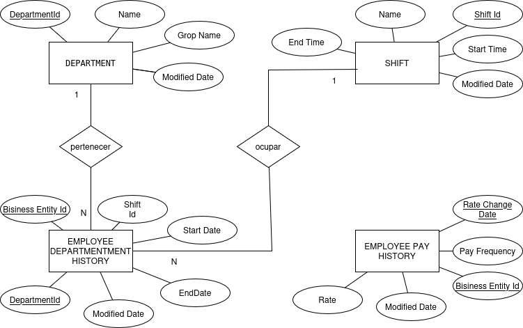

# AdventureWorks HR Files

## Resumen

Esta fuente de datos proviene de un módulo interno del sistema de recursos humanos de AdventureWorks, encargado de registrar y administrar la información relacionada con la estructura organizacional, los turnos laborales y el historial de pagos de los empleados.

Su propósito es centralizar los datos operativos del personal para permitir el análisis de la evolución de los empleados dentro de la empresa, la gestión de asignaciones por departamento, la supervisión de los horarios de trabajo y la evaluación de la política salarial a lo largo del tiempo.

Tipo de datos contenidos

La fuente está compuesta por cuatro tablas principales de datos estructurados:

Tabla EmployeeDepartmentHistory:
Registra el historial de asignaciones de los empleados a diferentes departamentos y turnos. Incluye los campos BusinessEntityId, DepartmentId, ShiftId, StartDate, EndDate y ModifiedDate.

Tabla Shift:
Contiene la información de los turnos laborales disponibles en la organización, con los campos ShiftId, Name, StartTime, EndTime y ModifiedDate.

Tabla EmployeePayHistory:
Almacena los cambios históricos en la compensación de los empleados, incluyendo los campos BusinessEntityId, RateChangeDate, Rate, PayFrequency y ModifiedDate.

Tabla Department:
Define la estructura departamental de la empresa, con los campos DepartmentId, Name, GroupName y ModifiedDate.

## Modelo conceptual

## Modelo lógico

+--------------------------+          +----------------------------+
|  DEPARTMENT              | 1       N|  EMPLOYEEDEPARTMENTHISTORY |
+--------------------------+----------+----------------------------+
| DepartmentId (PK)        |<-------->| DepartmentId (FK)          |
| Name                     |          | BusinessEntityId (PK)      |
| GroupName                |    +---> | ShiftId (FK)               |
| ModifiedDate             |    |     | StartDate                  |
+--------------------------+    |     | EndDate                    |
                                |     | ModifiedDate               |
                                |     +----------------------------+
                                |
                                |
                                | N
                                |
+--------------------------+    |
|  SHIFT                   | 1  |
+--------------------------+----+
| ShiftId (PK)             |
| Name                     |
| StartTime                |
| EndTime                  |
| ModifiedDate             |
+--------------------------+

+----------------------------+
| EMPLOYEEPAYHISTORY         |
+----------------------------+
| BusinessEntityId (PK)      |
| RateChangeDate (PK)        |
| Rate                       |
| PayFrequency               |
| ModifiedDate               |
+----------------------------+

## Catálogo de datos

### 🔹 Tabla: Department

**Propósito:**  
Define la estructura organizacional de la empresa, agrupando empleados por áreas funcionales o divisiones.

| Campo         | Tipo de Dato   | Restricciones    | Descripción de Negocio |
|----------------|----------------|------------------|------------------------|
| DepartmentId   | INT            | PK, NOT NULL     | Identificador único del departamento. |
| Name           | VARCHAR(100)   | NOT NULL         | Nombre del departamento. |
| GroupName      | VARCHAR(100)   | NOT NULL         | Grupo o división al que pertenece el departamento. |
| ModifiedDate   | DATE           | NOT NULL         | Fecha de la última modificación del registro. |

### 🔹 Tabla: Shift

**Propósito:**  
Contiene los diferentes turnos laborales disponibles en la organización. Permite definir los horarios de trabajo de los empleados.

| Campo         | Tipo de Dato   | Restricciones    | Descripción de Negocio |
|----------------|----------------|------------------|------------------------|
| ShiftId        | INT            | PK, NOT NULL     | Identificador único del turno. |
| Name           | VARCHAR(50)    | NOT NULL         | Nombre o descripción del turno  |
| StartTime      | TIME           | NOT NULL         | Hora de inicio del turno. |
| EndTime        | TIME           | NOT NULL         | Hora de finalización del turno. |
| ModifiedDate   | DATE           | NOT NULL         | Fecha de la última modificación del registro. |

### 🔹 Tabla: EmployeeDepartmentHistory

**Propósito:**  
Registra el historial de asignaciones de los empleados a diferentes departamentos y turnos laborales.  
Permite analizar la trayectoria laboral y los movimientos internos del personal.

| Campo             | Tipo de Dato | Restricciones          | Descripción de Negocio |
|--------------------|--------------|-------------------------|------------------------|
| BusinessEntityId   | INT          | PK                      | Identifica al empleado asignado. |
| DepartmentId       | INT          | FK → Department         | Indica el departamento en el que trabajó el empleado. |
| ShiftId            | INT          | FK → Shift              | Indica el turno en el que trabajó el empleado. |
| StartDate          | DATE         | NOT NULL                | Fecha de inicio de la asignación. |
| EndDate            | DATE         | NULL                    | Fecha de finalización de la asignación |
| ModifiedDate       | DATE         | NOT NULL                | Fecha de la última modificación del registro. |

### 🔹 Tabla: EmployeePayHistory

**Propósito:**  
Contiene el historial de cambios salariales de los empleados, permitiendo analizar la evolución de la compensación y las políticas de pago.

| Campo             | Tipo de Dato | Restricciones               | Descripción de Negocio |
|--------------------|--------------|------------------------------|------------------------|
| BusinessEntityId   | INT          | PK                           | Identifica al empleado asociado al cambio salarial. |
| RateChangeDate     | DATE         | PK, NOT NULL                 | Fecha en que se registró el cambio de salario. |
| Rate               | DECIMAL(10,2)| NOT NULL                     | Monto del salario o tarifa en el momento del cambio. |
| PayFrequency       | INT          | CHECK (PayFrequency IN (1,2)), NOT NULL | Frecuencia de pago. |
| ModifiedDate       | DATE         | NOT NULL                     | Fecha de la última modificación del registro. |

