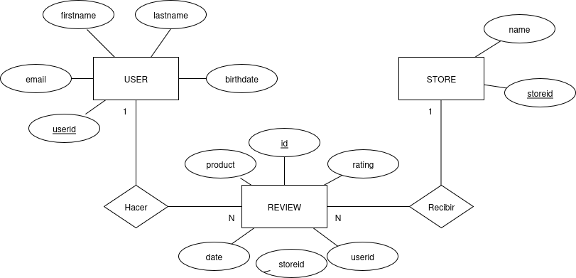

# Awesome Reviews API

## Resumen

Esta fuente de datos proviene de una API interna de AdventureWorks que centraliza las evaluaciones de los clientes sobre los productos adquiridos a través de los diferentes canales de venta de la empresa. Su propósito es recopilar y almacenar las opiniones directas de los clientes respecto a productos específicos, con el fin de medir la satisfacción del cliente y la calidad percibida de los productos, identificar oportunidades de mejora en aquellos con bajas calificaciones, analizar tendencias de preferencia por categoría de producto y respaldar decisiones estratégicas relacionadas con promociones, ajustes de precios o descontinuación de artículos.

Tipo de datos contenidos

La fuente contiene tres tablas principales de datos estructurados:

Tabla de evaluaciones (reviews): registra las calificaciones numéricas otorgadas por los usuarios, incluyendo los campos id, userid, storeid, product, rating y date.

Tabla de tiendas (store): almacena la información de las tiendas, con los campos storeid y name.

Tabla de usuarios (user): contiene los datos de los clientes que realizaron las evaluaciones, incluyendo userid, firstname, lastname, email y birthdate.

En conjunto, estas tablas proporcionan una vista integral del comportamiento y la satisfacción de los clientes, permitiendo analizar la relación entre los productos, los puntos de venta y las valoraciones recibidas.

## Modelo conceptual

## Modelo lógico

+-------------+           +--------------+          +---------------+
|   USER      | 1       N |    REVIEW    | N      1 |     STORE     |
+-------------+-----------+--------------+----------+---------------+
| userid (PK) |<--------->| userid (FK)  |          | storeid (PK)  |
| firstname   |           | storeid (FK) |<-------->| name          |
| lastname    |           | product      |          +---------------+
| email       |           | rating       |
| birthdate   |           | date         |
+-------------+           +--------------+

## Catálogo de datos

## 🔹 Entidad: **User**

**Propósito:**  
Contiene la información de los usuarios registrados en la plataforma que realizan reseñas de productos.  
Permite identificar a cada cliente y analizar sus patrones de comportamiento, frecuencia de reseñas o segmentación demográfica.

| Campo      | Tipo de Dato   | Restricciones          | Descripción de Negocio                                                                 |
|-------------|----------------|------------------------|----------------------------------------------------------------------------------------|
| userid      | INT            | PK, NOT NULL           | Identificador único del usuario. Permite diferenciar cada cliente dentro del sistema.  |
| firstname   | VARCHAR(50)    | NOT NULL               | Nombre del usuario. Se utiliza para identificación básica y personalización en reportes. |
| lastname    | VARCHAR(50)    | NOT NULL               | Apellido del usuario. Complementa la identificación personal.                          |
| email       | VARCHAR(100)   | UNIQUE, NOT NULL       | Correo electrónico del usuario. Permite comunicación y validación de identidad.        |
| birthdate   | DATE           | NULL                   | Fecha de nacimiento. Utilizada para análisis demográficos y segmentación por edad.     |

## 🔹 Entidad: **Store**

**Propósito:**  
Representa las tiendas o canales donde los usuarios adquieren los productos evaluados.  
Permite analizar el desempeño de cada tienda en función de la satisfacción del cliente.

| Campo   | Tipo de Dato   | Restricciones    | Descripción de Negocio                                                                |
|----------|----------------|------------------|----------------------------------------------------------------------------------------|
| storeid  | INT            | PK, NOT NULL     | Identificador único de la tienda o canal.                                              |
| name     | VARCHAR(100)   | NOT NULL         | Nombre comercial de la tienda. Usado para agrupar reseñas por punto de venta o canal.  |

## 🔹 Entidad: **Review**

**Propósito:**  
Registra las reseñas y calificaciones otorgadas por los usuarios a los productos comprados en una tienda.  
Es la tabla principal de hechos, ya que conecta las entidades **User** y **Store** con los datos de interacción (reseñas y puntuaciones).

| Campo    | Tipo de Dato   | Restricciones                                      | Descripción de Negocio                                                                 |
|-----------|----------------|----------------------------------------------------|----------------------------------------------------------------------------------------|
| id        | INT            | PK, NOT NULL                                       | Identificador único de la reseña.                                                      |
| product   | VARCHAR(100)   | NOT NULL                                           | Nombre del producto evaluado por el usuario.                                           |
| rating    | INT            | CHECK (rating BETWEEN 1 AND 5), NOT NULL           | Calificación numérica otorgada al producto (escala 1–5).                               |
| date      | DATE           | NOT NULL                                           | Fecha en la que se realizó la evaluación.               |
| userid    | INT            | FK → User(userid)                                  | Identifica al usuario que realizó la reseña.                                           |
| storeid   | INT            | FK → Store(storeid)                                | Indica en qué tienda o canal se adquirió el producto.                                  |
